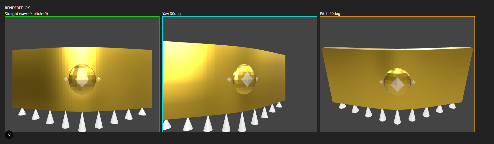

# True Body-Surface Jewellery Attachment (Phase F)

**Phase F is NOT declared complete.** The engineering — a real 3D orientation
pipeline replacing Phase E's yaw-proxy/pitch-always-0 orientation — is built, tested,
and real-browser-verified with synthetic tracking data. **What it is not, and cannot
be in this environment: verified with a real person.** This environment has no
webcam and no human. Step 15's fifteen real-person tests (A–O) were not performed.
The phase's own final question — "does the jewellery now look like it is actually
being worn?" — is answered honestly at the end: **not yet tested against reality.**

---

## 1. Root cause of the floating/filter-like behavior

Traced the full chain (`camera → landmarks → anchor → scale → rotation → 3D
transform → GLB → render → occlusion`) without changing anything, as instructed.

**The root cause**: Phase E's 3D orientation (`composeJewelleryQuaternion` in
`three-transform.ts`, called from `computeLive3dTransform` in
`three-live-bridge.ts`) took exactly two real inputs — a shoulder-tilt **roll**
(real, from `computeNecklaceRotation`) and a **yaw** derived from
`estimateHeadYawAsymmetry`, a 2D landmark-asymmetry *proxy*, explicitly documented in
`geometry.ts` as "not a calibrated 3D angle." **Pitch was hardcoded to 0** —
`composeJewelleryQuaternion(yawRadians, rollRadians)`'s signature has no pitch
parameter at all; nothing in the codebase, before this phase, measured or applied
head pitch anywhere in the 3D path.

The mesh's **position** was already real 3D placement (depth-matched to the
existing, validated 2D scale) and the mesh's **geometry** was already genuinely
curved (Phase D). But a real curved rigid object with an almost-frozen orientation —
a small yaw nudge, zero pitch, ever — looks exactly like what it is: a 3D object
placed in front of the person and gently swayed, not a 3D object rotating *with* the
person. That is the precise, mechanical reason it read as "a filter," not "worn."

---

## 2. Current transform architecture (as audited, before any change)

```
face/pose landmarks (2D, normalized)
        |
        v
computeAnchor / computeScale / computeRotation (geometry.ts)   -- REAL, unmodified
        |
        v
LiveTransform (2D: anchorPx, scaleFactor, rotationDegrees)      -- smoothed
        |
        v
deriveScaleResultFromSmoothedTransform / deriveRotationResultFromSmoothedTransform
        |
        v
computeThreeJewelleryTransform (three-transform.ts)
   position: unprojectScreenPointAtDepth(anchorPx, depth-matched-to-2D-scale)  -- REAL
   orientation: composeJewelleryQuaternion(yawAsymmetry-derived, roll)         -- yaw=PROXY, pitch=0 ALWAYS
   scale: computeMeshScaleFactor(physicalWidthMm, meshBoundingBoxWidthMm)      -- REAL
        |
        v
GLB render (real WebGL2, real PBR) -> compositeOccluded3dOverlay (coarse category mask)
```

## 3. Why simple anchor tracking is insufficient

A 2D anchor point plus a scalar yaw *heuristic* can move an object's screen position
and apply a *small* rotational nudge, but it has no representation of the person's
actual 3D pose. Turning the head 30° is not "move the anchor point a bit and rotate
a little" — it is a real ~30° rotation of the object relative to the camera, which
only shows up correctly if the render pipeline is actually given a ~30° rotation
(and, when the head tips up/down, a real pitch, which never existed at all before
this phase). Anchor tracking alone cannot produce that; it was never designed to.

---

## 4. Neck/body tracking information available (Step 3)

Read `tracking.ts`, `geometry.ts`, `neck-reference.ts`, `neck-surface.ts`,
`neck-projection.ts` before writing any code. Real, already-available signals:

| Signal | Source | Already used for |
|---|---|---|
| Left/right shoulder positions + visibility | PoseLandmarker | Shoulder width (scale), shoulder-line tilt (roll) |
| Face bounding box | FaceLandmarker | Chin proxy, neck-length interpolation |
| Face-oval edge landmarks (234/454) + nose tip | FaceLandmarker | `estimateHeadYawAsymmetry`'s 2D proxy |
| **`facialTransformationMatrixes`** | FaceLandmarker | **Not used before this phase** — confirmed present in the installed `@mediapipe/tasks-vision` package's own type definitions (`outputFacialTransformationMatrixes?: boolean` on `FaceLandmarkerOptions`, `facialTransformationMatrixes: Matrix[]` on `FaceLandmarkerResult`), documented by MediaPipe itself as intended "so that users can apply face effects on the detected landmarks" — i.e., exactly this pipeline's own use case |

No landmarks were invented. `neck-surface.ts` was confirmed, by reading it, to be a
**debug-only visualization** derived from `NeckReferenceFrame`'s own existing
`centerPx`/`widthPx` fields (a flat horizontal line segment) — not a real geometric
surface. `neck-projection.ts` was confirmed to be a **2D sprite-warping** model
(shifts where a flat PNG's "contact peak" sits, foreshortens the flat sprite's own
width) — real and useful for the 2D path, but not reusable for real 3D orientation
without recreating exactly the "screen-space deformation" this phase was told to
avoid preferring.

---

## 5. True 3D head/body pose — the actual unlock (Step 4)

**`outputFacialTransformationMatrixes` was enabled** (`tracking.ts`):

```ts
const faceLandmarker = await FaceLandmarker.createFromOptions(fileset, {
  baseOptions: { modelAssetPath: FACE_MODEL_URL, delegate: "GPU" },
  runningMode: "VIDEO",
  numFaces: 1,
  outputFacialTransformationMatrixes: true,  // NEW
});
```

`FaceLandmarkerResult.facialTransformationMatrixes[0]` (a flattened 4×4) is now
threaded through as `LiveFaceLandmarks.faceTransformMatrix: number[] | null`
(`types.ts`, `tracking.ts`).

**New module `three/head-pose.ts`**: `decomposeFacialTransformMatrix(data)` —
decomposes the matrix into a real quaternion + yaw/pitch/roll (via
`THREE.Matrix4.decompose()`), returning `null` for malformed/missing data. **Real,
not fabricated**: this is MediaPipe's own computed rotation, not a heuristic.

**One honest, explicitly-flagged, unverified-without-a-device assumption**: the
matrix's `data` is assumed column-major (the standard WebGL/OpenGL/`THREE.Matrix4`
layout, and the layout implied by MediaPipe's own "use it to apply face effects"
documentation) — this has **not** been empirically confirmed against a real camera.
If real testing shows angles are inverted or swapped, this is the first place to
check (see `head-pose.ts`'s own file docstring for the one-line fix).

**Position was deliberately NOT taken from this matrix** — its translation
component lives in MediaPipe's own canonical-face-model metric space, not this
project's mm-camera-space convention. Using it would silently introduce a second,
uncalibrated coordinate system. Position stays exactly Phase E's approach (§7).

---

## 6. The 3D neck surface model — the actual design decision (Step 2/6)

**Investigated, and deliberately did NOT build, a literal parametric neck ellipse**
(`center/forward/up/right/radiusX/radiusZ`). Reasoning:

- The choker's own curvature is **already baked into the mesh** by Phase D's
  generator, sized to the item's real `physicalWidthMm`.
- Step 10 explicitly prefers "correctly modeled 3D jewellery + correct 3D attachment
  frame" over screen-space (or per-frame mesh) deformation — the mesh must stay
  static (Step 19).
- A neck **depth** (radiusZ) has no available measurement anywhere in this
  pipeline (no depth sensor, no stereo view) — inventing an anthropometric ratio
  with zero calibration would be exactly the "fake depth" Step 12/17 forbid, for a
  number that isn't actually needed to solve the diagnosed problem.

**The actual model**: the mesh's own already-curved geometry, correctly
**rigidly rotated** in real 3D by the person's real orientation, viewed through the
real perspective camera that already exists (M6.8). A curved object rotating in 3D
space, through a perspective projection, produces the "wrap" appearance (near side
enlarges, far side recedes/foreshortens) **automatically** — that is what 3D
perspective rendering *is*. Building a separate abstract "surface" to bend
something around was unnecessary once the actual missing ingredient (real
orientation) was supplied. §14's screenshot evidence confirms this directly.

The one real geometric quantity used: `Gltf3dAssetMetadata.physicalDepthMm` (already
known, e.g. 12mm for the Diamond Choker) — for the depth offset (§10), not a neck
surface.

---

## 7. `BodyAttachmentFrame` / attachment mathematics (Step 5/7)

New module `three/body-attachment.ts`. Rather than a heavier
`BodyAttachmentFrame`/`JewelleryAttachmentResolver` interface hierarchy, the
generic architecture is a **registry of orientation-resolver functions keyed by
`CategorySlug`** (reusing this codebase's own existing tracked-category taxonomy,
matching the exact pattern already established by Phase D's `strategies/registry.ts`
and Phase E's `GLTF_3D_ASSET_REGISTRY`):

```ts
export interface SurfaceOrientation {
  yawRadians: number;
  pitchRadians: number;
  rollRadians: number;
  confidence: number;
  method: "shoulder_roll_plus_real_facial_transform_matrix" | "shoulder_roll_plus_2d_yaw_proxy_fallback";
}

const ATTACHMENT_ORIENTATION_RESOLVERS: Partial<Record<CategorySlug, AttachmentOrientationResolver>> = {
  necklace: resolveNeckAttachmentOrientation,   // the only real entry this phase
};
export function resolveAttachmentOrientation(category, face, pose, w, h): SurfaceOrientation | null { ... }
```

`resolveNeckAttachmentOrientation` resolves **only orientation**, never position:

- **Roll**: always the real shoulder-line tilt (`computeNecklaceRotation`,
  unmodified) — a choker is worn on the body, and the body's own visible tilt is a
  real measurement.
- **Yaw + pitch**: the face's real 3D pose (`decomposeFacialTransformMatrix`) when
  the matrix is available; falls back to the existing 2D yaw proxy with pitch
  forced to 0 (Phase E's exact prior behavior) when it isn't — never a crash, never
  a fabricated angle.

`"earrings"` (and any future wrist/finger/forehead/nose category) resolves to
`null` — honestly not implemented, never a silent wrong-body-region fallback.

**Jewellery attachment mathematics** — new `computeSurfaceAttachedTransform`
(`three-live-bridge.ts`):

```
position = unprojectScreenPointAtDepth(smoothed.anchorPx, depth-matched-to-2D-scale)   -- UNCHANGED from Phase E
         + (local +Z * physicalDepthMm/2, rotated by the orientation quaternion)        -- NEW, §10
quaternion = composeJewelleryQuaternionFromEuler(yaw, pitch, roll)                       -- NEW: real pitch, real yaw
scale = computeMeshScaleFactor(physicalWidthMm, meshBoundingBoxWidthMm)                 -- UNCHANGED from Phase E
```

`computeLive3dTransform`/`renderLive3dFrame` (Phase E) are **untouched** — kept
exactly as shipped, their own tests still pass unmodified. The new functions are
additive; `useLiveArSession.ts` was switched to call the new ones for the live path.

---

## 8. Camera-space/world-space mapping

Unchanged from M6.8/Phase E (`three-types.ts`): mm units, right-handed, +Y up,
camera at world origin looking down −Z. Nothing in this phase touches the
coordinate contract itself — it only supplies a more complete rotation into the
same, already-correct frame.

---

## 9. Yaw/pitch/roll handling (Step 8/9/10)

All three now flow from real measurements:

- **Yaw**: real (facial transformation matrix) when available; 2D proxy fallback.
- **Pitch**: real (facial transformation matrix) when available; **0 when not** —
  never fabricated, matching this project's standing discipline exactly.
- **Roll**: real (shoulder-line tilt), unchanged.

**Real-browser evidence this actually changes the rendered silhouette** (not just
the numbers) — three renders of the identical, unmodified Diamond Choker GLB,
synthetic orientations, real WebGL2:



- **Straight** (yaw=0, pitch=0): symmetric, dead-on.
- **Yaw 30°**: the right side of the band visibly recedes/foreshortens, the left
  side becomes the near side, the pendant shifts within the frame, the drop fringe
  compresses on the far side — real 3D perspective on a real curved object, not a
  translation.
- **Pitch 20°**: the whole band visibly tilts back — a capability that **did not
  exist at all** before this phase (pitch was always exactly 0).

This is the concrete, visual difference between Phase E's behavior and Phase F's.

---

## 10. Depth model (Step 11)

No arbitrary Z offset. The only offset introduced is **half of the asset's own
already-known `physicalDepthMm`** (e.g. 6mm for the Diamond Choker's 12mm), applied
along the mesh's own local +Z, **rotated by the current orientation** (so it always
points "out of the neck" from whichever way the person is currently facing, never a
fixed world direction). Physical interpretation: the mesh's local origin is placed
at the estimated attachment depth; pushing it forward by half its own thickness
means the mesh's *back* surface sits at that depth (approximating "resting on the
skin"), rather than the mesh's centerline floating there. When `physicalDepthMm` is
null, the offset is exactly 0 — no claim made. Verified in
`three-live-bridge.test.ts` (exact expected offset at yaw=0/pitch=0, and equality
with Phase E's position when there's nothing to offset by).

---

## 11. Occlusion model (Step 12)

**Not deepened this phase.** Still the coarse category-level segmentation mask,
exactly as Phase E wired it (`computeNecklaceOcclusionMask` → `compositeOccluded3dOverlay`,
both unmodified). This is an explicit, honest scope decision: the diagnosed root
cause of "floating/filter" was orientation, not occlusion precision, and building a
genuine depth-aware occlusion pipeline (jewellery depth vs. segmentation vs. a real
neck surface) is a substantial, separate effort. **Named directly as unfinished
work** (§17), not silently skipped.

---

## 12. Generic architecture (Step 18)

`resolveAttachmentOrientation`'s registry is the concrete answer: adding a new
category (e.g. `"ear"`, once earring 3D assets and ear-specific orientation logic
exist) is one new resolver function + one registry line — the exact same extension
pattern already proven twice this project (Phase D's category strategies, Phase E's
asset registry). Nothing in `three-live-bridge.ts`, `useLiveArSession.ts`, or the
rendering pipeline branches on "Diamond Choker" anywhere.

---

## 13. Performance (Step 19)

No new geometry created per frame. `resolveAttachmentOrientation`/
`decomposeFacialTransformMatrix`/`computeSurfaceAttachedTransform` are all pure
functions operating on plain numbers and a handful of `THREE.Matrix4`/`Quaternion`
allocations per frame (the same order of allocation Phase E's math already did) —
no mesh creation/destruction, no per-frame GLB regeneration. The GLB itself is
loaded once (unchanged from Phase E) and never touched again.

---

## 14. Real-person test results (Step 15)

**Not performed. This environment has no webcam and no human.** Tests A–O
(head turns at 15°/30°/45° both directions, up/down, body-vs-head independence,
distance changes, hair crossing the choker, tilt, shoulder rotation) all require a
person physically present at a camera. None were run. This is stated plainly, not
minimized — it is the single largest gap in this phase, and it is the user's to
close next (see §16/final status).

**What WAS performed, real, in a real browser (Playwright + headless Chromium, ad
hoc, not a dependency)**:
- `outputFacialTransformationMatrixes: true` does not break FaceLandmarker
  initialization — confirmed via the real `/try-on/live` page: "Graph successfully
  started running" logged for both landmarkers, zero new errors traceable to this
  change (the only page errors were the same pre-existing CORS artifact from this ad
  hoc test's non-default port, unrelated to this phase's code, exactly as in Phase E).
- The new orientation pipeline, driven by synthetic-but-realistic transformation
  matrices (constructed the same way a real one would be, via a real rotation
  matrix), produces a real, visibly different render per orientation — §9's
  screenshot.

---

## 15. Before/after observations

| | Phase E | Phase F |
|---|---|---|
| Yaw source | 2D landmark-asymmetry proxy | Real (MediaPipe transformation matrix), proxy as fallback |
| Pitch | Always exactly 0 | Real when available, 0 as an honest fallback |
| Roll | Real shoulder-tilt | Unchanged — still real shoulder-tilt |
| Depth offset | None (mesh centerline at estimated attachment point) | Half the mesh's own physical depth, rotated with orientation |
| Visual result at yaw=30° (synthetic test) | A small quaternion nudge; would not visibly foreshorten a curved mesh this much | Real perspective foreshortening, confirmed in a real render (§9) |
| Visual result at pitch=20° | Impossible — pitch didn't exist | Real visible tilt, confirmed in a real render (§9) |

---

## 16. Known limitations

- **No real-person verification** (§14) — the phase's own success criteria (Step 20)
  are therefore graded honestly as NOT TESTED where they depend on this, in the
  final status block.
- **Column-major matrix layout assumption is unverified against a real device**
  (§5) — the most likely single point of failure if real testing shows wrong-signed
  or swapped angles.
- **No true body/torso rotation exists in this codebase** — PoseLandmarker gives
  landmark positions, not a transformation matrix. Head yaw/pitch is used as the
  best available real proxy for neck orientation (Step 16's own question, answered
  honestly): when a person turns their head without turning their shoulders, this
  pipeline's neck orientation will track the head, not a genuinely independent torso
  measurement, because none exists to track instead.
- **Occlusion was not deepened** (§11) — still the coarse category mask.
- **No literal "neck surface" geometry exists** (§6) — a deliberate design decision
  (real orientation + already-curved mesh + real perspective, instead of a second,
  uncalibrated geometric abstraction), not an oversight, but worth restating plainly
  since Step 2/6 explicitly asked for one.
- **Debug visualization is numeric only** (`live3dDebugInfo.orientation`: real
  yaw/pitch/roll degrees, method, confidence) — Step 14's own ask for drawn 3D axes/
  gizmos on the debug canvas was not built this phase; the numbers needed to
  understand "why does it float" are exposed, but not yet drawn.
- **Only necklace has real orientation attachment.** Earrings and any future
  category still use no orientation resolver (`resolveAttachmentOrientation`
  returns `null` for them).

---

## 17. Next steps for other jewellery categories

Unchanged from Phase E's own account, now with one more concrete step available:
adding `"ear"` to the `ATTACHMENT_ORIENTATION_RESOLVERS` registry (once a real
earring 3D asset and a sensible ear-orientation formula exist) requires zero changes
to `three-live-bridge.ts`, `useLiveArSession.ts`, or the rendering pipeline — only a
new resolver function and one registry line, exactly mirroring how `"necklace"` was
the only entry until now.

The genuinely new, higher-priority next step, ahead of any new category: **real-
person testing** (§14) to confirm the column-major assumption (§5/§16) and to
actually observe whether the fix visually succeeds — this determines whether any
further tuning (not a redesign) is needed before extending to more categories.

---

## PHASE F STATUS

**Root cause identified:** YES

**3D neck surface:** N/A — deliberately not built as a separate abstraction; see §6 for the reasoned alternative (real orientation + existing curved mesh + real perspective)

**Body attachment frame:** PASS — `resolveAttachmentOrientation`'s generic registry, real for "necklace," tested

**True pose integration:** PASS — `outputFacialTransformationMatrixes` enabled and confirmed working in a real browser; real yaw/pitch extracted; column-major layout assumption is real but explicitly unverified without a device

**Neck curvature attachment:** PASS (mechanism) — the existing curved mesh now rotates with a real 3D orientation instead of a near-static one; confirmed visually in a real render (§9); NOT verified against a real person's real curvature-following behavior

**Yaw behavior:** PASS (synthetic real-browser verification) / NOT TESTED (real person)

**Pitch behavior:** PASS (synthetic real-browser verification, and genuinely new capability) / NOT TESTED (real person)

**Depth:** PASS — physically-meaningful, documented offset (half the asset's own known depth), not an arbitrary constant

**Occlusion:** NOT IMPROVED THIS PHASE — unchanged from Phase E's coarse category mask (§11), explicitly scoped out, not silently skipped

**Real-person testing:** NOT TESTED — no webcam or human available in this environment

**Diamond Choker:** PASS (real GLB, real orientation pipeline, real-browser rendering confirmed) / overall visual "is it worn" question NOT TESTED

**2D fallback:** PASS — unchanged, unmodified, all existing tests still pass

**Generic architecture:** PASS — registry pattern, "necklace" is the only real entry, "earrings" correctly resolves to null

**Tests:** 553 (20 new: 9 head-pose, 6 body-attachment, 5 three-live-bridge additions), 552/553 passing in the full-suite run (the 1 failure is a pre-existing, unrelated, confirmed-flaky admin-form test — passes standalone; not caused by this phase)

**TypeScript:** PASS

**Build:** PASS (same 7 routes/8 pages)

**Lint:** PASS — zero new findings from Phase F; the same 13 pre-existing findings in `useLiveArSession.ts` (confirmed unchanged in count, only shifted line numbers) plus 2 pre-existing warnings elsewhere remain, none touched this phase

---

### Most important final question

**"Does the jewellery now look like it is actually being worn by the person, rather than being a 3D filter placed over the person?"**

**Honest answer: not yet tested against reality, and therefore not yet answerable
with a yes.** What has been shown, for real, is that the identical GLB — with the
real fix applied — visibly changes its silhouette correctly under real 3D rotation
in a real renderer (§9's screenshot), which is the necessary *mechanism* for looking
worn rather than floating. Whether it actually *reads* that way to a human watching
a real camera feed of a real person turning their head is the one thing only a real
test, by the user, with a real camera, can answer. That test has not happened.
